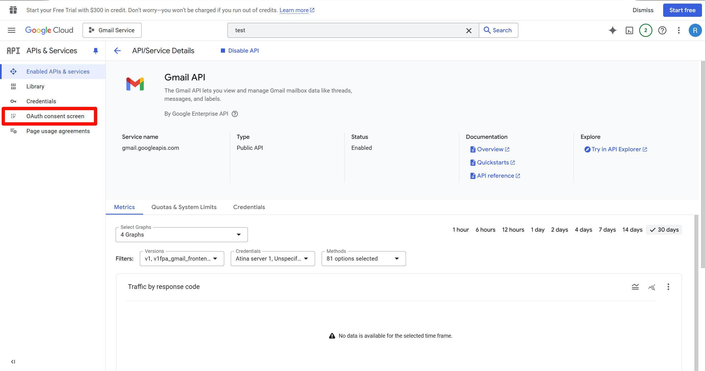

# Setup Gmail API

In order to use the service, you should do the following steps:

## Step 1: Create a Google account

No need to explain why, you need a Google account to own a Gmail account.

## Step 2: Create a Google Cloud project

Visit [Google Cloud Console](https://console.cloud.google.com/) and create a new project if you haven't created one before.

## Step 3: Enable Gmail service for the project

Select the project and go to `APIs & Services` -> `Enabled API & services`.

Check if `Gmail API` has already been enabled. If not, click `Enable APIs & services`.

Select `Gmail API` from `Google Workspace` and enable it.

## Step 4: Create credentials

After enable, create a new credential.

Select `Gmail API` and allow the credential to access user data.

Then fill in all the blanks in step 2, 3 & 4, nothing special. You don't need to add any additional scope either.

## Step 5: Save your credentials

Download your credentials and save it properly.

## Step 6: Add test user to access to the API

Now the API is under test and it's not accessable by default. Therefore you should add your Google account into test users in order to use Gmail API.

First, go to `OAuth consent screen`.

Then, click `Audience` and add test users.

Copy your Google account (Email address) into it and save, you're done.
